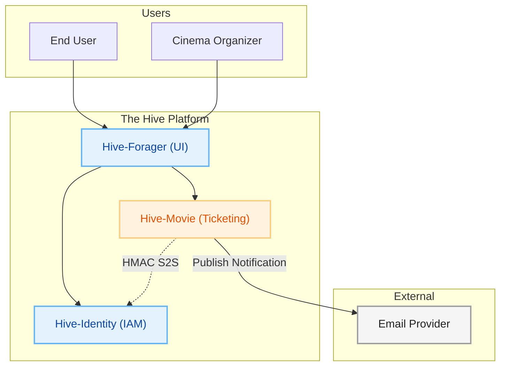
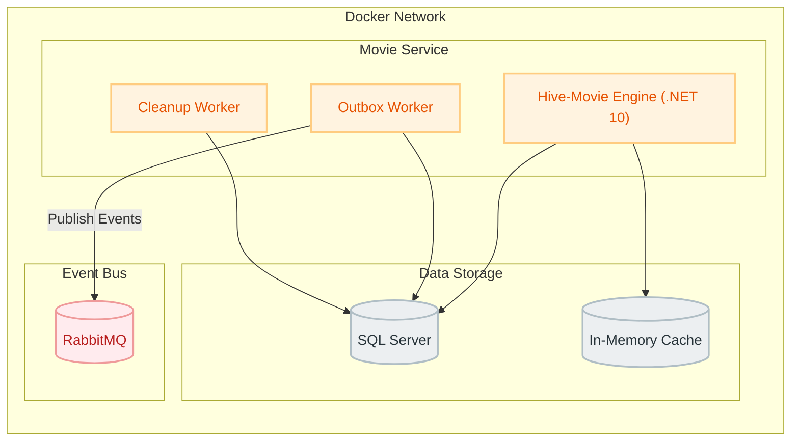
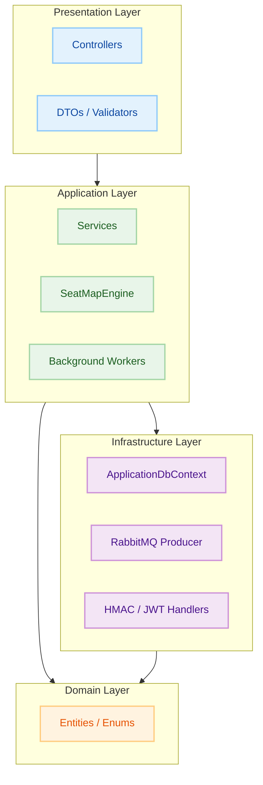
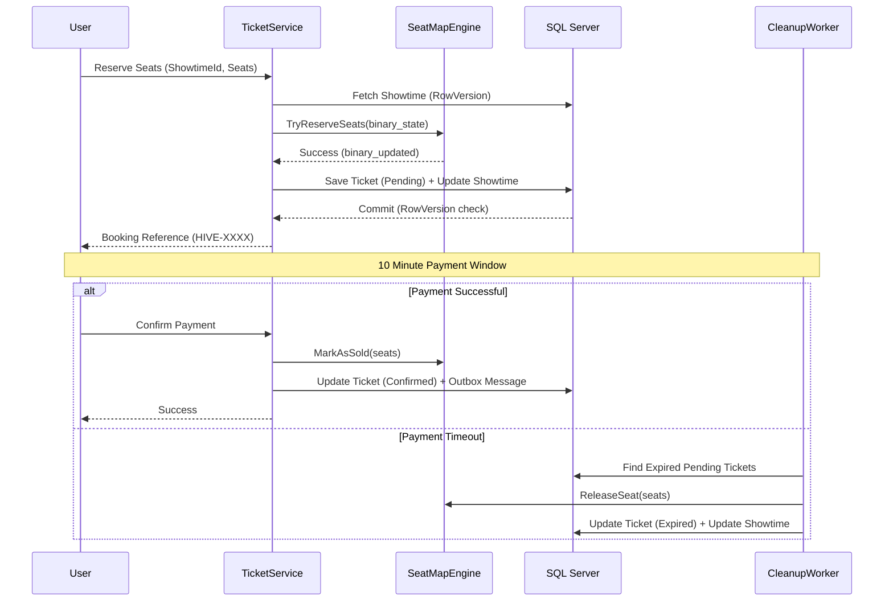
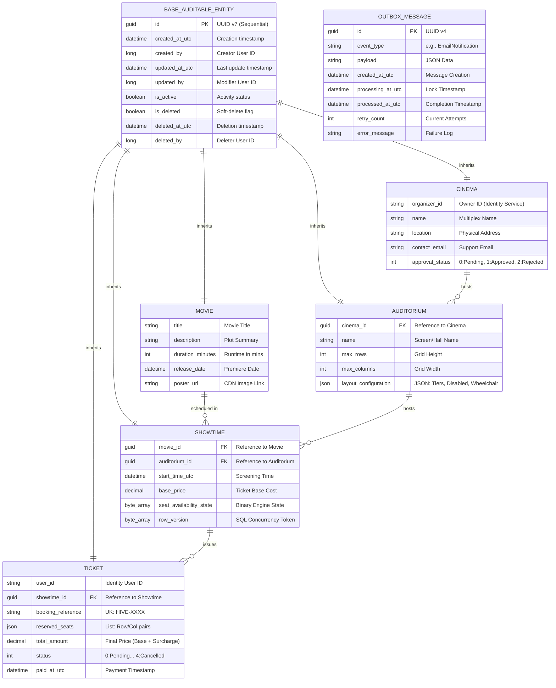

<p align="center">

</p>

<h1 align="center">Hive-Movie (Catalog & Ticketing Service)</h1>

<p align="center"><em>The high-performance core engine for movie management, cinema orchestration, and atomic seat reservations within the EventHive ecosystem.</em></p>

<p align="center">


</p>

---

> **Hive-Movie** is the ticketing powerhouse of the Hive platform. Built with **C# 13** and **.NET 10**, it handles massive
> concurrent seat bookings using a specialized zero-allocation engine, manages cinema and auditorium lifecycles, and
> maintains a rich movie catalog with multi-tenant ownership.

---

### 🔗 Associated Repositories

* 👉 **[The-Hive-Project (Main Hub)](https://github.com/Naveen2070/The-Hive-Project)**
* 👉 **[Hive-Identity (Auth Service)](https://github.com/Naveen2070/The-Hive-Project/tree/main/services/identity-service)**
* 👉 **[Hive-Forager-UI (Frontend)](https://github.com/Naveen2070/Hive-Forager-UI)**

---

## 🚀 Key Features

* **⚡ High-Performance Seat Engine:** Implements a custom, zero-allocation `SeatMapEngine` utilizing raw byte arrays for
  O(1) status checks and atomic in-memory reservations, ensuring lightning-fast booking even for massive venues.
* **🛡️ Optimistic Concurrency:** Protects against overbooking using SQL Server `RowVersion` tokens, allowing for
  lock-free read operations while guaranteeing data integrity during high-traffic sales.
* **🏢 Multi-Tenant Cinema Management:** Allows organizers to manage their own cinema multiplexes, auditoriums, and
  showtimes with strict ownership validation and administrative approval workflows.
* **🆔 Modern ID Generation:** Uses **UUID v7 (Sequential UUIDs)** for all primary keys, combining the uniqueness of
  GUIDs with the database performance of sequential integers.
* **🏗️ Outbox Pattern:** Guarantees reliable asynchronous communication. Business events (like booking confirmations) are persisted to an `OutboxMessages` table and dispatched to **RabbitMQ** by a dedicated background worker.
* **🧹 Automated Cleanup:** Features a `TicketCleanupWorker` that automatically releases reserved seats if payments are
  not confirmed within the expiration window (10 minutes) and marks past showtimes as expired.
* **📊 Organizer Dashboard:** Provides real-time statistical aggregation including revenue trends, sales growth, and
  recent transaction history for cinema owners.

---

## 🛠️ Tech Stack

* **Language:** C# 13 / .NET 10
* **Web Framework:** ASP.NET Core Web API
* **ORM:** Entity Framework Core (EF Core) 10
* **Database:** Microsoft SQL Server 2022
* **Security:** JWT (Multi-tenant Domain Roles), HMAC-SHA256 (Zero-Trust S2S)
* **Messaging:** RabbitMQ (AMQP)
* **Validation:** FluentValidation
* **Internal Communication:** Refit (Type-safe REST client for Identity Service)
* **Documentation:** OpenAPI / Scalar UI

---

## 🏗️ Architecture

Hive-Movie follows a modern microservices pattern focusing on high throughput and eventual consistency.

### 1. High-Level Ecosystem



### 2. Container & Messaging Architecture



### 3. Layered Architecture (Internal)



### 4. Seat Reservation Lifecycle



---

## 📊 Entity Relationship Diagram (ERD)



---

## 📂 Project Structure

```text
Hive-Movie/
├── Configuration/      # DI Registrations, JWT & OpenApi Config
├── Controllers/        # REST Endpoints (Cinemas, Movies, Tickets, etc.)
├── Data/               # DBContext, Migrations, Initializers
├── DTOs/               # Data Transfer Objects & Validation models
├── Engine/             # High-performance binary SeatMapEngine
├── Infrastructure/     # Messaging, S2S Clients, Security Handlers
├── Middleware/         # Global Exception Handling
├── Models/             # Domain Entities (EF Core)
├── Services/           # Business Logic Layer
└── Workers/            # Background Tasks (Outbox, Cleanup)
```

---

## ⚙️ Getting Started

### 1. Prerequisites
* **.NET 10 SDK**
* **SQL Server 2022**
* **RabbitMQ**

### 2. Run with Docker
```bash
docker-compose up --build
```

### 3. Database Migration
```bash
dotnet ef database update
```

---

<p align="center">
Built with ❤️, ☕, and high-performance .NET. 🚀<br>
<b>Architected and maintained by <a href="https://github.com/Naveen2070">Naveen</a></b>
</p>
